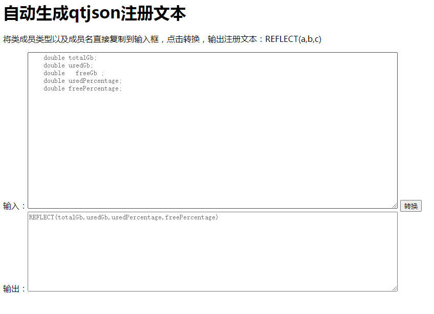
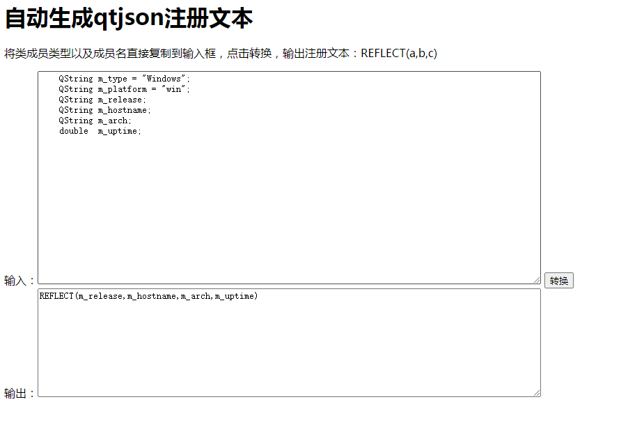

# qtjson


## Introduction
【[中文](./README_CN.md) 】
[qtjson] is a dependency-free, header-only, ready-to-use automatic serialization and deserialization library.
It is completely based on Qt's own JSON-related objects.
This library is modified from https://github.com/archibate/reflect-hpp.

## Features
**Header-Only**: No need to compile or link any additional libraries.

**Dependency-Free**: Only relies on the Qt framework, making it easy to integrate into existing projects.

**Automatic Serialization/Deserialization**: Automatically converts between C++ objects and JSON format with minimal code.

**Customizable**: Supports custom types and complex data structures.

**Cross-Platform**: Works on all platforms supported by Qt (Windows, macOS, Linux, etc.).

## Getting Started

### Prerequisites
Qt 5.10 or higher

### Installation
Since qtjson is a header-only library, you just need to include the header files in your project.

### Adding Header Files to Your Project
qtjson.hpp
reflect.hpp


### Including the Header File


```
#include"qtjson.hpp"
```

### Using the Namespace
```
using namespace qtjson; // You can also skip this declaration
```

### Custom Types
#### Member Registration

You can manually input the member registration, or open the auto-reflect.html file in a browser, enter the property names, and auto-generate the registration text:


<p align="center">
    
</p>

<p align="center">
    
</p>


```

class OsInfo {
public:

    QString m_type = "Windows";
    QString m_platform = "win";
    QString m_release;
    QString m_hostname;
    QString m_arch;
    double  m_uptime;
	
	// Member registration
    REFLECT(m_type,m_platform,m_release,m_hostname,m_arch,m_uptime);
};

```


#### Serialization and Deserialization

```
//Custom type
void testCustom(){

    using namespace qtjson;
    //1.Convert object to QJsonObject
    OsInfo * osInfo = new OsInfo();
    osInfo->m_platform ="平台";
    osInfo->m_arch = "x86";
    osInfo->m_hostname = "lenovo";
    osInfo->m_release = "win10212H";
    osInfo->m_uptime = 12.6;
    QJsonObject j1= objToJson(*osInfo);
    for (auto it = j1.begin(); it != j1.end(); ++it) {
        qDebug() << "Key:" << it.key() << ", Value:" << it.value().toString();
    }


    //2.Convert QJsonObject to object
    OsInfo o =  jsonToObj<OsInfo>(j1);
    qDebug()<< o.m_platform<<","
             <<o.m_arch<<","
             <<o.m_hostname<<","
             <<o.m_release<<","
             <<o.m_uptime;


    //Convert object to JSON string
    QString jsonStr = serialize(*osInfo);
    /*
        {
            "m_arch": "x86",
            "m_hostname": "lenovo",
            "m_platform": "平台",
            "m_release": "win10212H",
            "m_type": "Windows",
            "m_uptime": 12.6
        }
     */

    qDebug()<<jsonStr.toUtf8().data();

    //Convert JSON string to object
    OsInfo o2 =  deserialize<OsInfo>(jsonStr);
    qDebug()<< o2.m_platform<<","
             <<o2.m_arch<<","
             <<o2.m_hostname<<","
             <<o2.m_release<<","
             <<o2.m_uptime;


    delete osInfo;
}

```


## Extending Custom Types

For non-primitive types such as std::map and std::vector, special handling is required.

### Adding Specialized Types
At the end of qtjson.hpp, within the qtjson namespace, add the following template class format:

```

template <typename ...SpecializedTypeGenerics>
struct special_traits<SpecializedType> {
    static constexpr bool value = true;

    static QJsonValue objToJson(SpecializedType const &object) {
       // This function should return a QJsonValue
    }

    static SpecializedType jsonToObj(QJsonValue const &root) {
       // This function should convert QJsonValue to SpecializedType
    }
};


```


### Examples
```

//1.std::vector
template <class T, class Alloc>
struct special_traits<std::vector<T, Alloc>> {
    static constexpr bool value = true;

    static QJsonValue objToJson(std::vector<T, Alloc> const &object) {
        QJsonArray root;
        for (auto const &elem: object) {

            qDebug()<< elem;
            qDebug()<<  qtjson::objToJson(elem);
            root.append(qtjson::objToJson(elem));
        }

        qDebug()<<root;
        return root;
    }

    static std::vector<T, Alloc> jsonToObj(QJsonValue const &root) {
        std::vector<T, Alloc> object;
        for (auto const &elem : root.toArray()) {
            object.push_back(qtjson::jsonToObj<T>(elem));
        }
        return object;
    }
};

//2.std::map
template <class K, class V, class Alloc>
struct special_traits<std::map<K, V, Alloc>> {
    static constexpr bool value = true;

    static QJsonValue objToJson(std::map<K, V, Alloc> const &object) {
        QJsonObject root;
        for (auto const &elem: object) {
            root[elem.first] = qtjson::objToJson(elem.second);
        }
        return root;
    }

    static std::map<K, V, Alloc> jsonToObj(QJsonValue const &root) {
        std::map<K, V, Alloc> object;
         QJsonObject  jsonObject = root.toObject();

        for (auto it = jsonObject.begin(); it != jsonObject.end(); ++it) {
            const QString &key = it.key();
            const QJsonValue &value = it.value();
            object[key] = qtjson::jsonToObj<V>(root[key]);

        }
        return object;
    }
};


```


